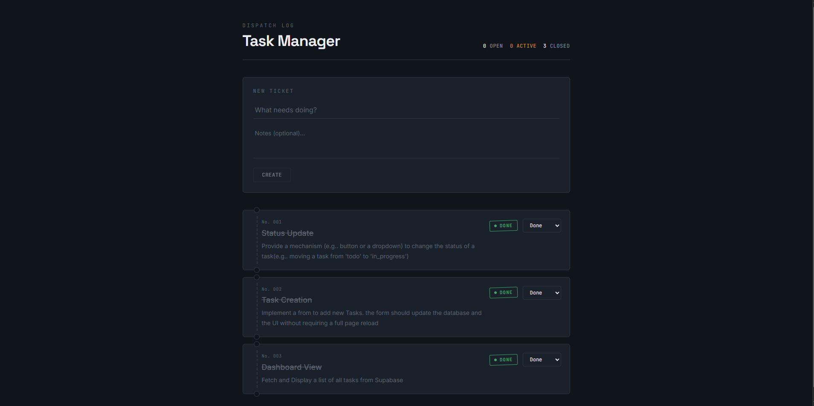

# Task Management Dashboard

A lightweight task tracker built with Next.js and Supabase — create tasks, move them through Open → Active → Closed, and see updates reflected instantly.

**Live demo:** [task-management-coral-xi.vercel.app](https://task-management-coral-xi.vercel.app)



## Tech stack

- **Next.js** (App Router) + TypeScript
- **Tailwind CSS** for styling
- **Supabase** for the Postgres database and client SDK

## Getting started

### Prerequisites

- Node.js 18+
- A [Supabase](https://supabase.com) project

### 1. Clone the repository

```bash
git clone https://github.com/nero213/task-management.git
cd task-management
```

### 2. Install dependencies

```bash
npm install
```

### 3. Configure environment variables

Create a `.env.local` file in the project root:

```env
NEXT_PUBLIC_SUPABASE_URL=your_supabase_url
NEXT_PUBLIC_SUPABASE_ANON_KEY=your_supabase_anon_key
```

You'll find both values under **Project Settings → API** in your Supabase dashboard.

### 4. Run the dev server

```bash
npm run dev
```

Open [http://localhost:3000](http://localhost:3000) to view the app.

## Documentation

A core architectural decision was organizing the application logic into a modular service layer located within services/tasks/. Rather than embedding direct API calls or Supabase database client queries directly inside React components, each operation (Read, Create, and Update) is encapsulated into its own dedicated async function (getTasks, addTask, updateTask). This isolation keeps our client-side React components lean, highly readable, and solely focused on managing UI states and user interactions. Furthermore, exporting these module functions via a central index file (services/tasks/index.ts) provides a clean public API surface that simplifies future refactoring, unit testing, and maintainability.

To maintain runtime and compile-time reliability across the application, strict TypeScript typings were established in types/database.ts. Defining explicit interface contracts and custom union types—such as TaskStatus for PostgreSQL enum alignment—guarantees that state transformations and database mutations strictly adhere to expected schemas. For the presentation layer, standardizing on Tailwind CSS allowed us to eliminate bulky inline styles and redundant custom CSS files in favor of utility-first styling. This design approach ensures responsive layouts, consistent color tokens, immediate visual feedback (such as inline status changes and disabled button states during async operations), and optimal production bundle sizes.

To accelerate the implementation lifecycle and ensure deployment readiness, AI pairing tools were heavily leveraged throughout the design and execution phases. AI assistance was utilized to rapidly prototype, enforce consistency in TypeScript interface structures, and generate optimized utility patterns. Crucially, during integration, AI-driven diagnostics helped quickly identify and resolve schema misalignment issues between the client application and PostgreSQL database enums, drastically reducing debugging overhead.
